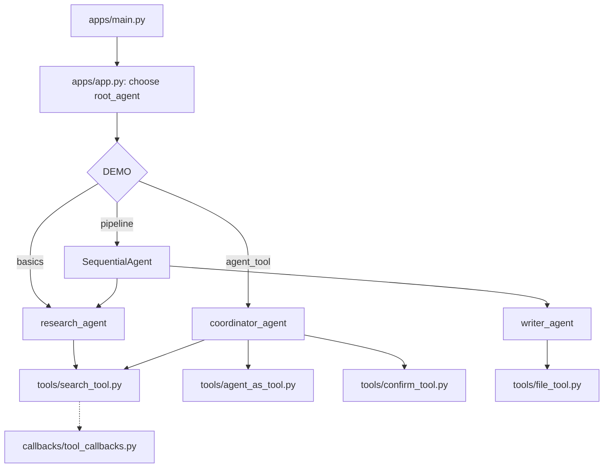
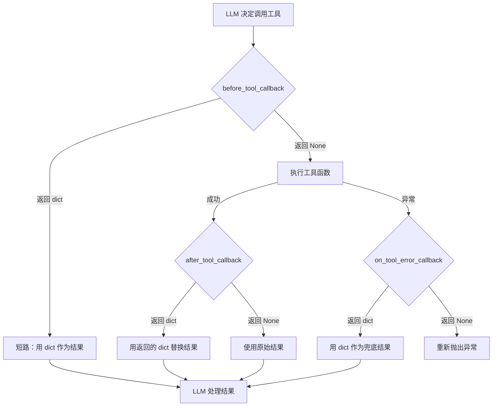
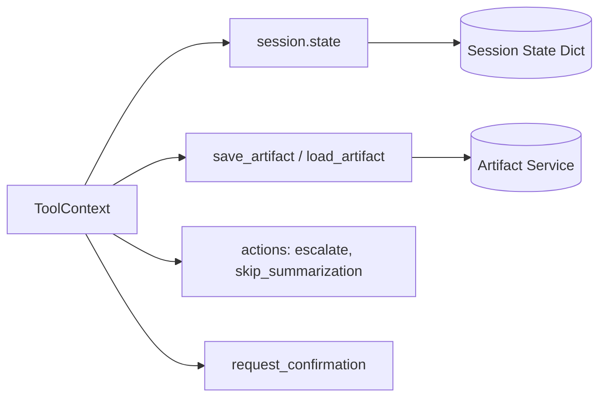
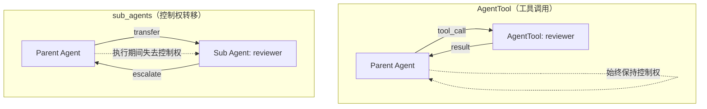
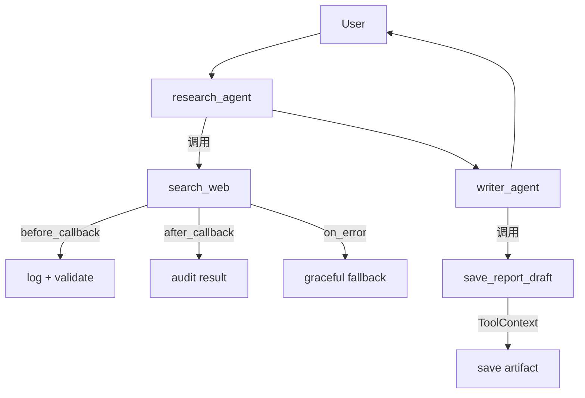
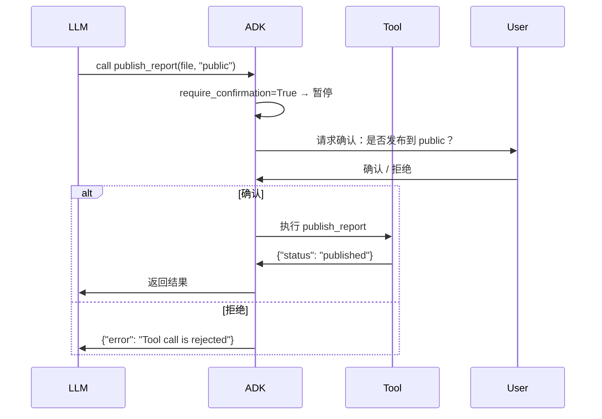

# 工具调用与工程化组织：架构说明

本阶段展示 ADK 工具系统的六大能力：FunctionTool、ToolContext、Callbacks、Confirmation、AgentTool、LongRunningFunctionTool。

## 组件与职责

- `tools/`：工具定义层，每个文件一类工具能力
- `callbacks/`：跨切面层，可观测性与安全回调
- `agents/`：认知层，使用工具的 Agent 角色
- `workflows/`：编排层，组合 Agent 的流水线
- `apps/`：入口层，DEMO 路由 + Runner

## 总体流程图

## 工具生命周期

## ToolContext 关系图

## AgentTool vs sub_agents

## Pipeline 流程图

## Confirmation 流程

