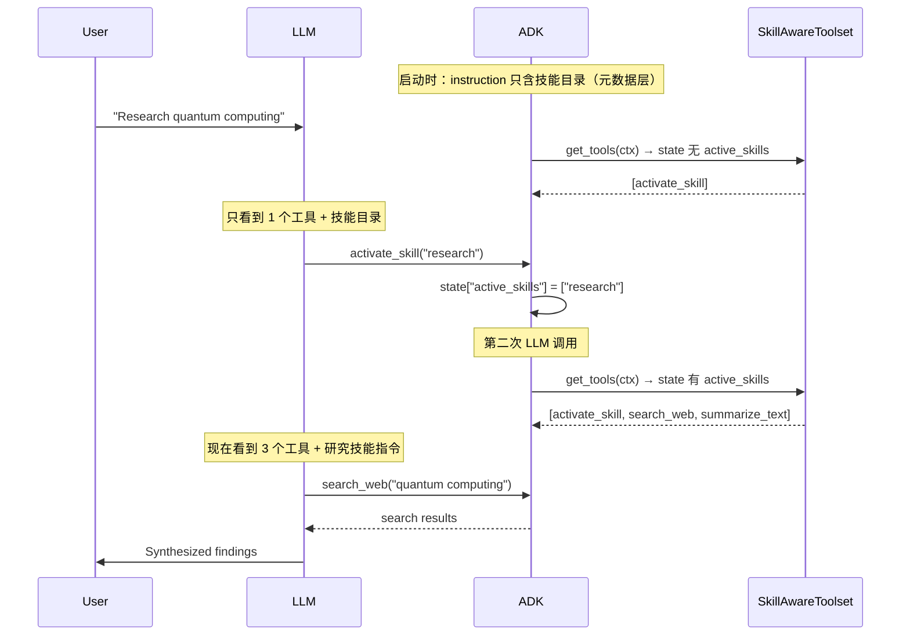
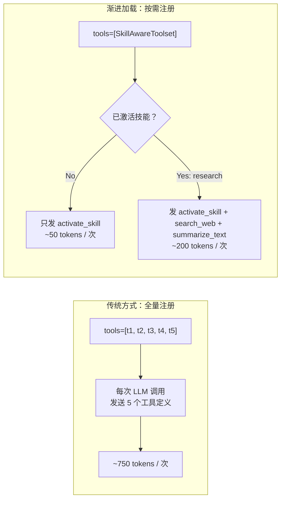
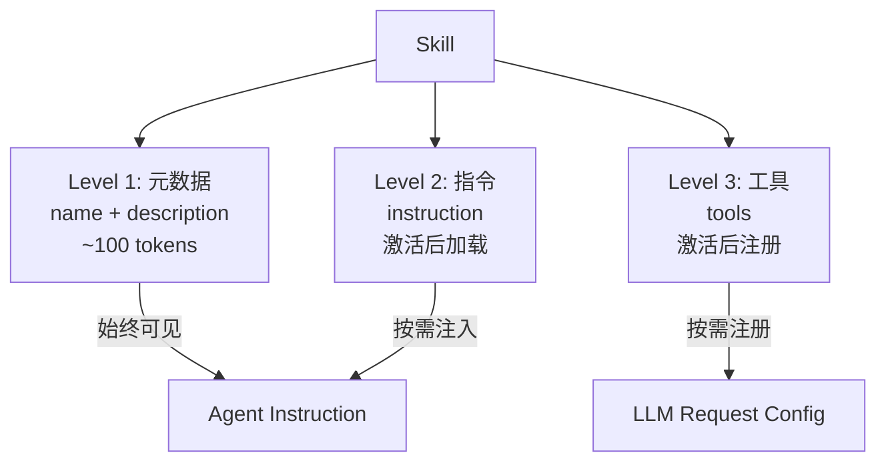
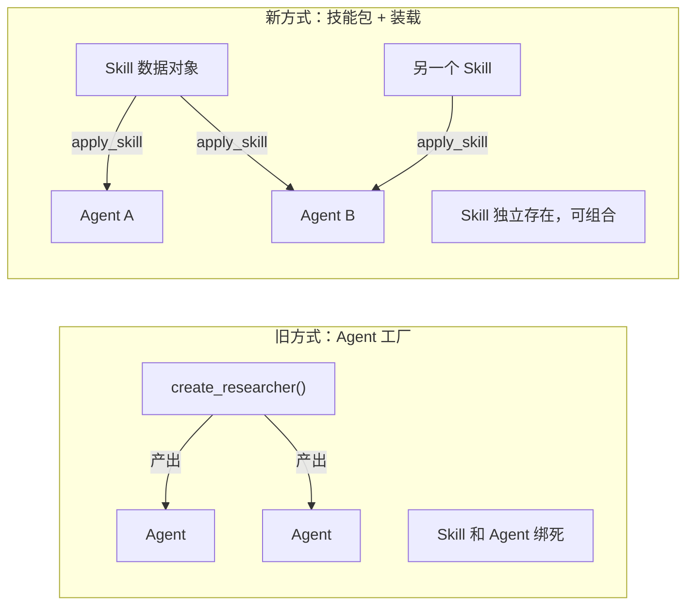
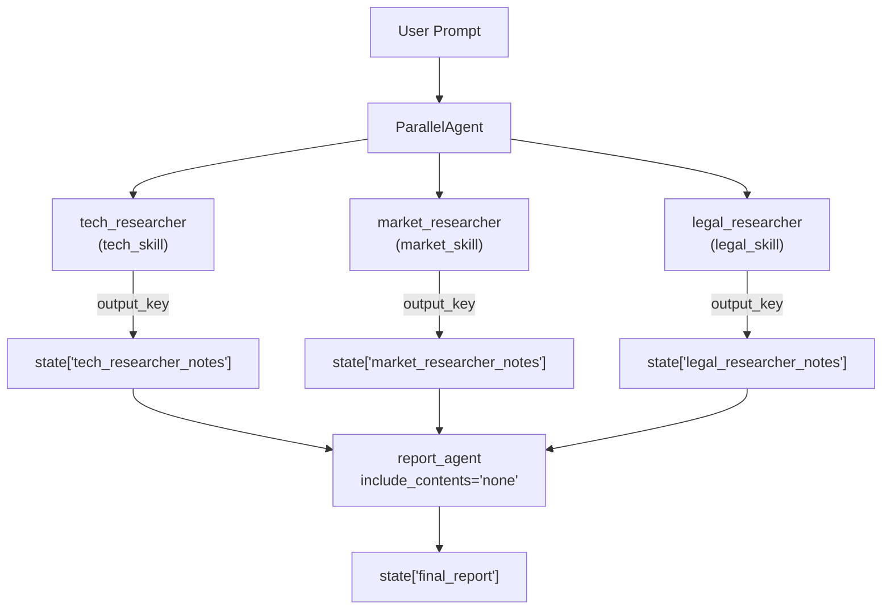
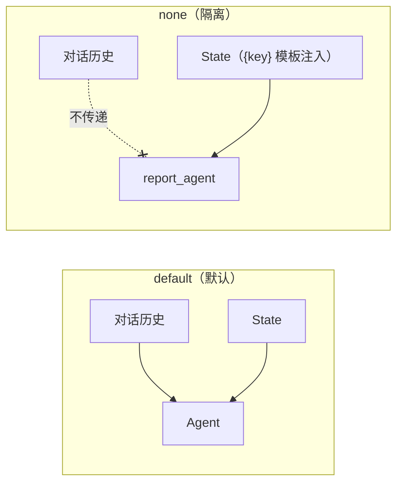
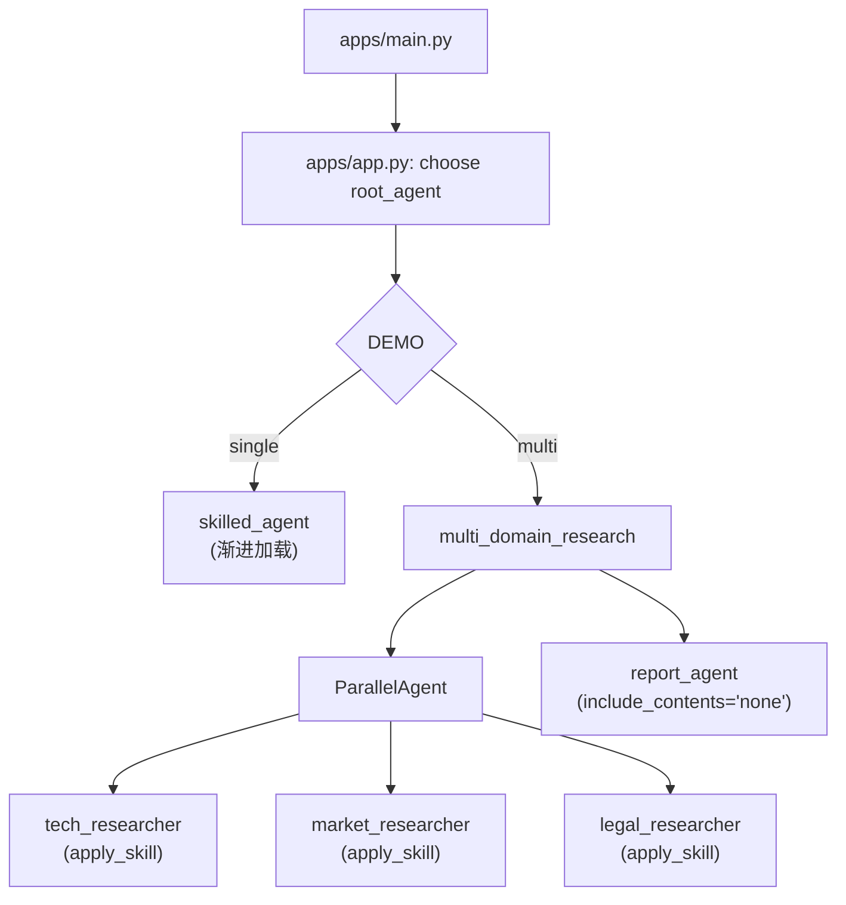

# 技能复用：架构说明

## 核心理念

Skill（技能包）= 可按需加载的知识 + 工具，不是 Agent 工厂。

## 渐进加载机制

```mermaid
sequenceDiagram
  participant User
  participant LLM
  participant ADK
  participant Toolset as SkillAwareToolset

  Note over ADK: 启动时：instruction 只含技能目录（元数据层）
  User->>LLM: "Research quantum computing"
  ADK->>Toolset: get_tools(ctx) → state 无 active_skills
  Toolset-->>ADK: [activate_skill]
  Note over LLM: 只看到 1 个工具 + 技能目录
  LLM->>ADK: activate_skill("research")
  ADK->>ADK: state["active_skills"] = ["research"]

  Note over ADK: 第二次 LLM 调用
  ADK->>Toolset: get_tools(ctx) → state 有 active_skills
  Toolset-->>ADK: [activate_skill, search_web, summarize_text]
  Note over LLM: 现在看到 3 个工具 + 研究技能指令
  LLM->>ADK: search_web("quantum computing")
  ADK-->>LLM: search results
  LLM->>User: Synthesized findings
```

## 传统 Tool 注册 vs 渐进加载

```mermaid
flowchart LR
  subgraph "传统方式：全量注册"
    A1["tools=[t1, t2, t3, t4, t5]"] --> B1["每次 LLM 调用<br/>发送 5 个工具定义"]
    B1 --> C1["~750 tokens / 次"]
  end
  subgraph "渐进加载：按需注册"
    A2["tools=[SkillAwareToolset]"] --> B2{"已激活技能？"}
    B2 -->|No| C2["只发 activate_skill<br/>~50 tokens / 次"]
    B2 -->|Yes: research| D2["发 activate_skill + search_web + summarize_text<br/>~200 tokens / 次"]
  end
```

## Skill 三层结构

```mermaid
flowchart TD
  S[Skill] --> L1["Level 1: 元数据<br/>name + description<br/>~100 tokens"]
  S --> L2["Level 2: 指令<br/>instruction<br/>激活后加载"]
  S --> L3["Level 3: 工具<br/>tools<br/>激活后注册"]

  L1 -->|始终可见| PROMPT[Agent Instruction]
  L2 -->|按需注入| PROMPT
  L3 -->|按需注册| LLM_REQ[LLM Request Config]
```

## 技能包 vs Agent 工厂

```mermaid
flowchart LR
  subgraph "旧方式：Agent 工厂"
    FAC["create_researcher()"] -->|产出| AG1[Agent]
    FAC -->|产出| AG2[Agent]
    Note1["Skill 和 Agent 绑死"]
  end
  subgraph "新方式：技能包 + 装载"
    SK[Skill 数据对象] -->|apply_skill| AG3[Agent A]
    SK -->|apply_skill| AG4[Agent B]
    SK2[另一个 Skill] -->|apply_skill| AG4
    Note2["Skill 独立存在，可组合"]
  end
```

## 多领域研究数据流

```mermaid
flowchart TD
  U[User Prompt] --> PAR[ParallelAgent]
  PAR --> TR["tech_researcher<br/>(tech_skill)"]
  PAR --> MR["market_researcher<br/>(market_skill)"]
  PAR --> LR["legal_researcher<br/>(legal_skill)"]
  TR -->|output_key| TS["state['tech_researcher_notes']"]
  MR -->|output_key| MS["state['market_researcher_notes']"]
  LR -->|output_key| LS["state['legal_researcher_notes']"]
  TS --> RA["report_agent<br/>include_contents='none'"]
  MS --> RA
  LS --> RA
  RA --> FR["state['final_report']"]
```

## include_contents 隔离

```mermaid
flowchart LR
  subgraph "default（默认）"
    H1[对话历史] --> A1[Agent]
    S1[State] --> A1
  end
  subgraph "none（隔离）"
    H2[对话历史] -.-x|不传递| A2[report_agent]
    S2["State（{key} 模板注入）"] --> A2
  end
```

## 总体流程图

```mermaid
flowchart TD
  A[apps/main.py] --> B[apps/app.py: choose root_agent]
  B --> C{DEMO}
  C -->|single| D["skilled_agent<br/>(渐进加载)"]
  C -->|multi| E[multi_domain_research]
  E --> F[ParallelAgent]
  F --> G["tech_researcher<br/>(apply_skill)"]
  F --> H["market_researcher<br/>(apply_skill)"]
  F --> I["legal_researcher<br/>(apply_skill)"]
  E --> J["report_agent<br/>(include_contents='none')"]
```
