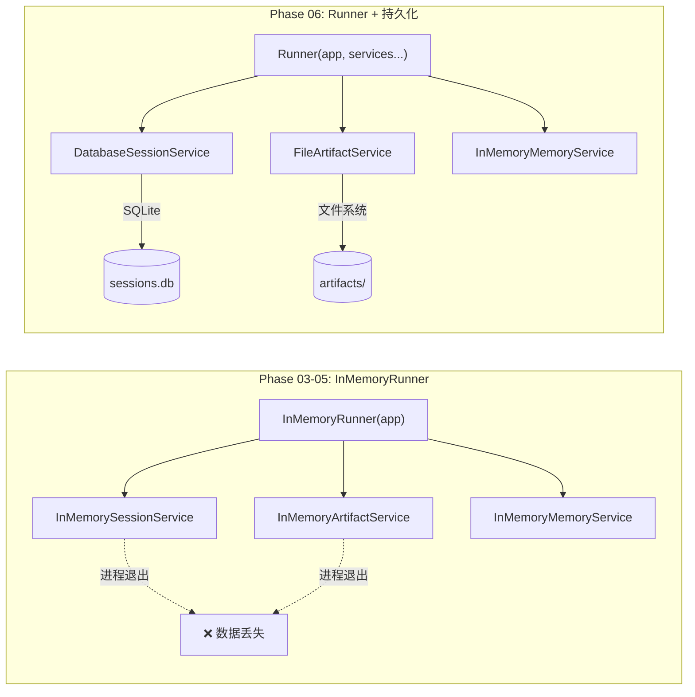
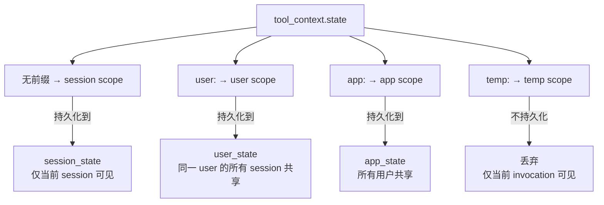
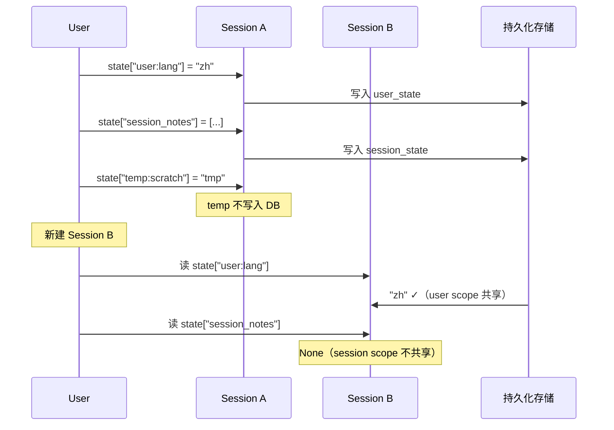
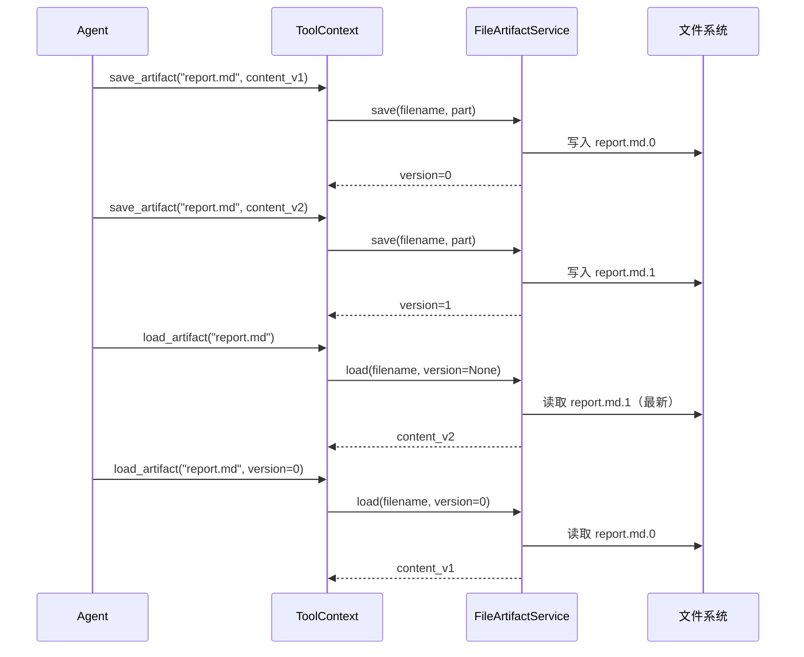
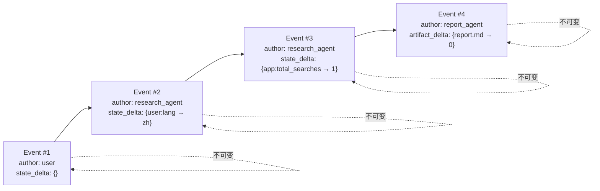
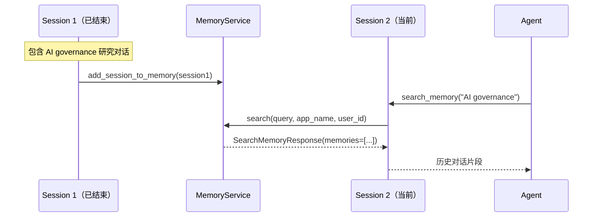
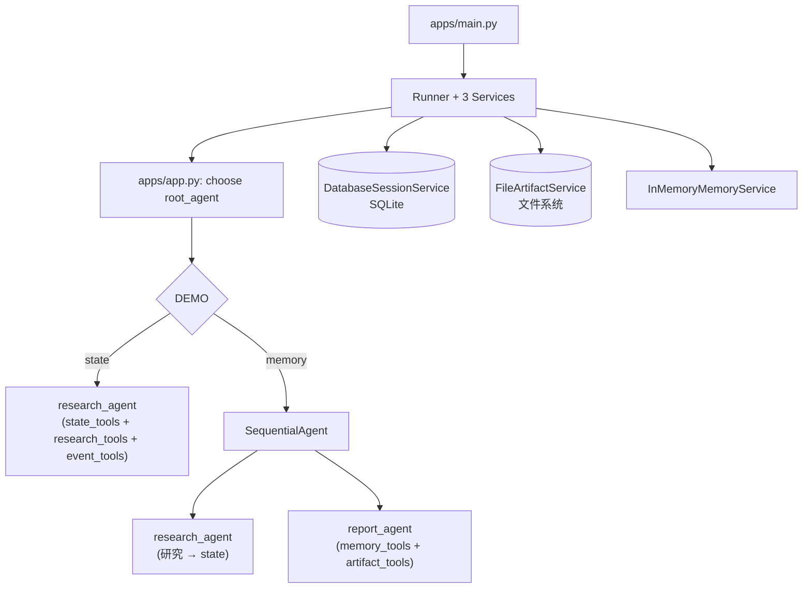

# 记忆与状态管理：架构说明

## 核心理念

从 InMemoryRunner（一切用完即丢）切换到 Runner + 持久化 Service（数据长期保存）。

## InMemoryRunner vs Runner

## State 四种作用域

## State Scope 生命周期

## Artifact 版本管理

## Event Sourcing

## Memory 搜索流程

## 总体流程图

