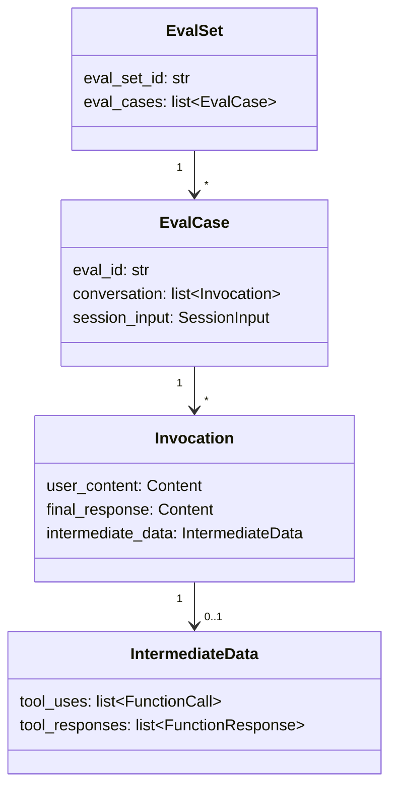
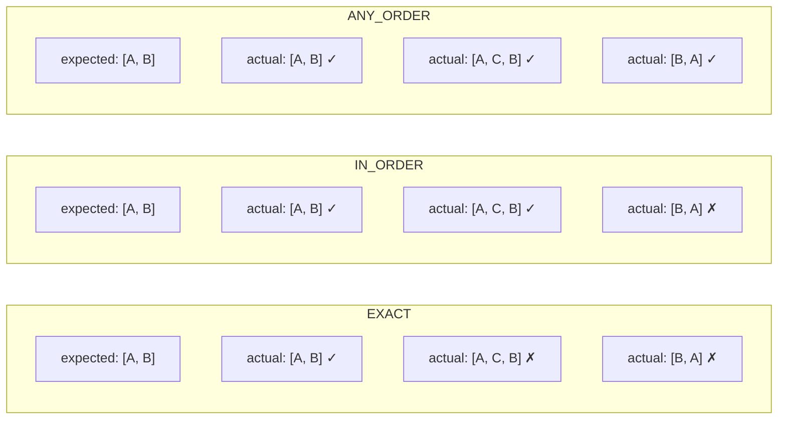
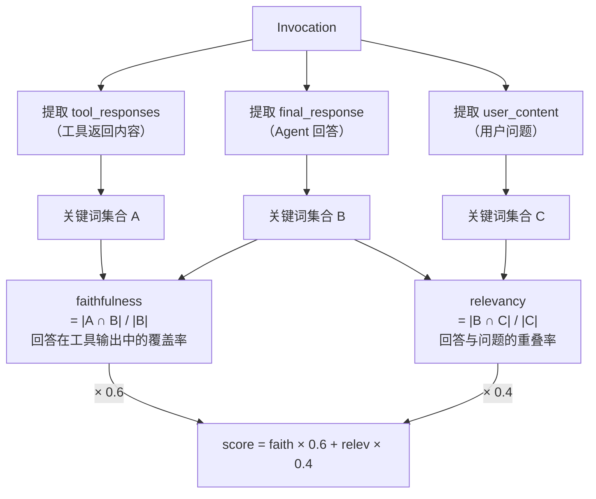
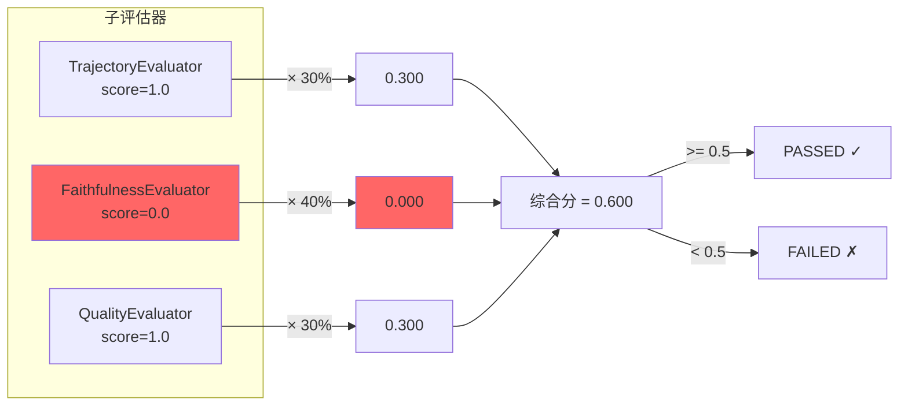
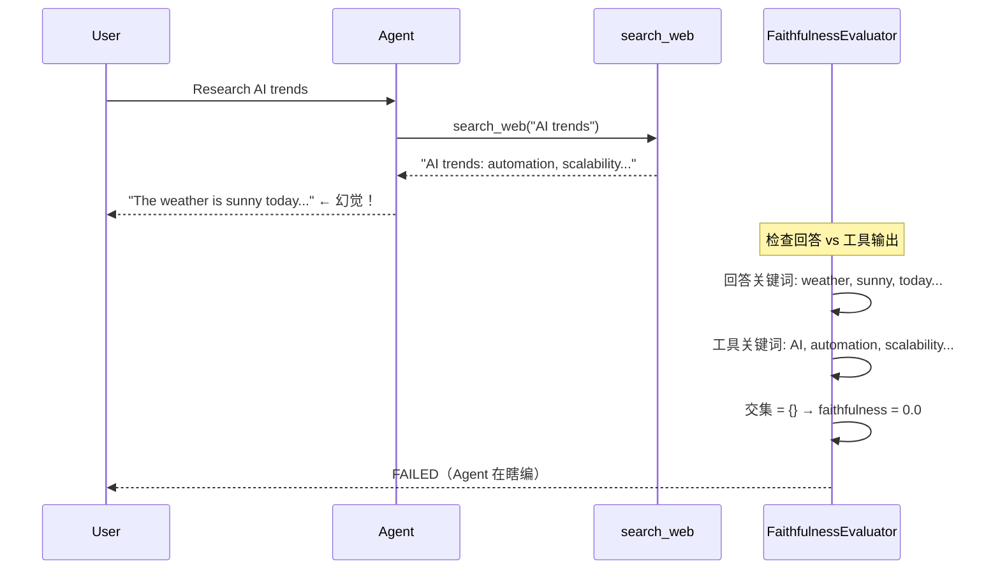
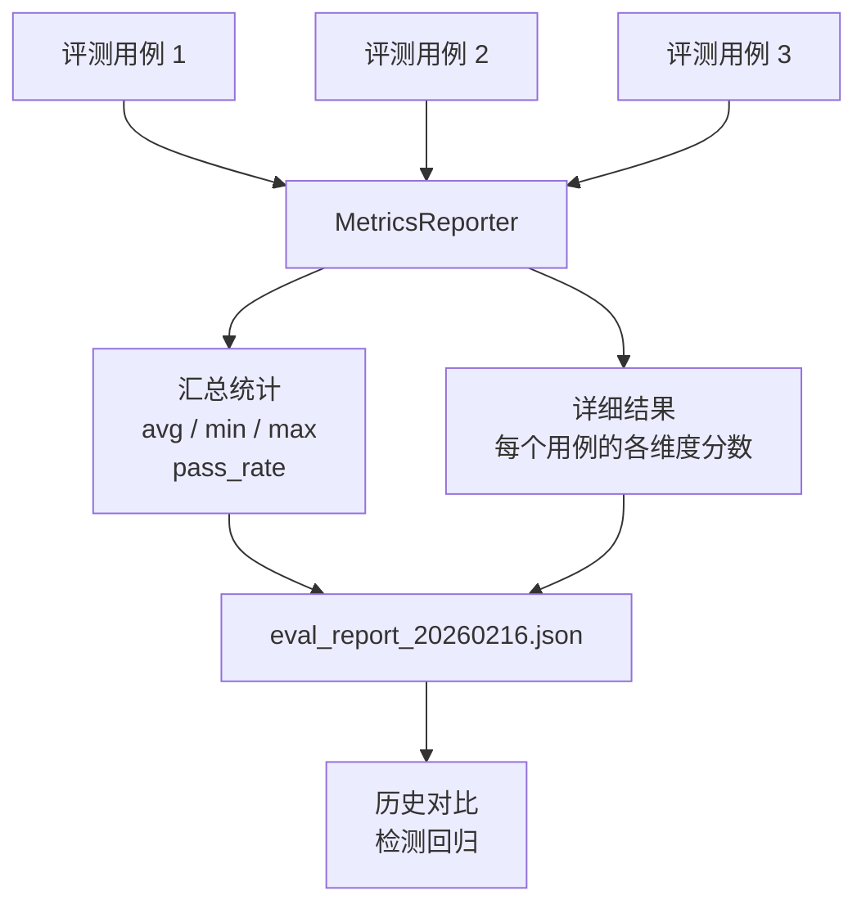
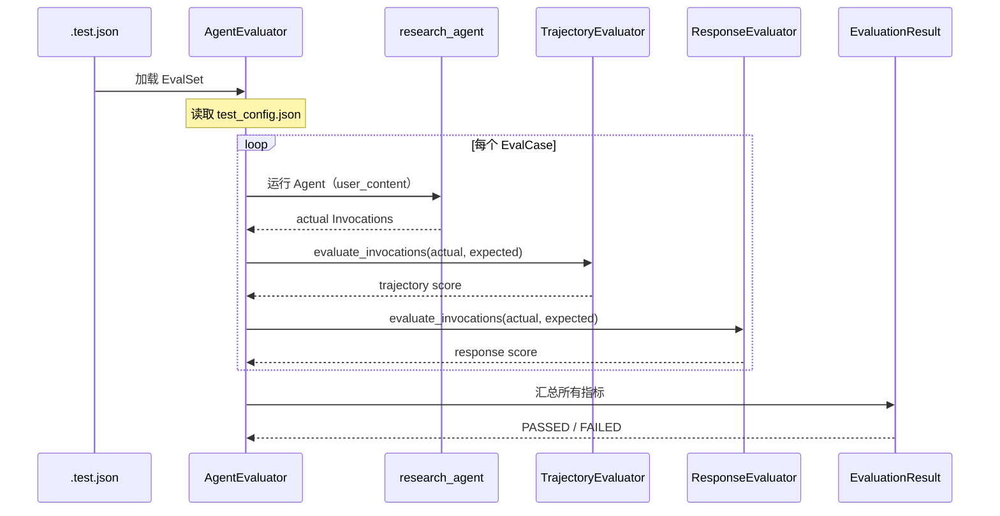
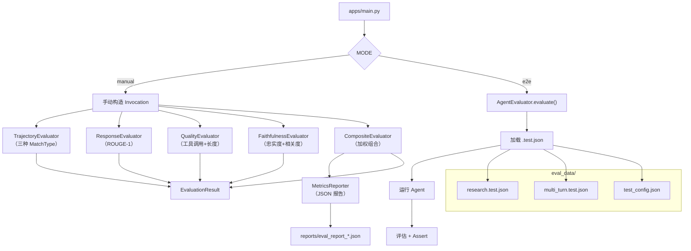
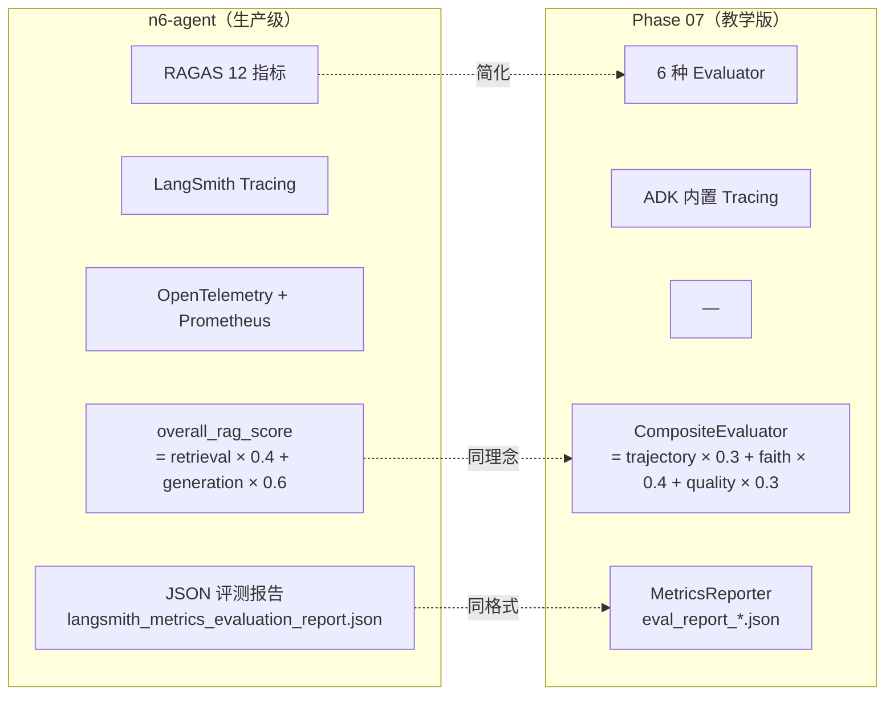

# 评估与回归：架构说明

## 核心理念

Agent 不是写完就结束——需要可重复的评测机制，在每次修改后验证行为没有退化。

## 评测数据结构



## TrajectoryEvaluator 三种匹配模式



## Evaluator 继承体系

```mermaid
classDiagram
    class Evaluator {
        <<ABC>>
        +evaluate_invocations(actual, expected) EvaluationResult
    }
    class TrajectoryEvaluator {
        -threshold: float
        -match_type: MatchType
    }
    class ResponseEvaluator {
        -threshold: float
        -metric_name: str
    }
    class QualityEvaluator {
        -required_tool: str
        -min_response_length: int
    }
    class FaithfulnessEvaluator {
        -faithfulness_weight: float
        -relevancy_weight: float
    }
    class CompositeEvaluator {
        -evaluators: dict
        -threshold: float
        +print_report()
    }

    Evaluator <|-- TrajectoryEvaluator
    Evaluator <|-- ResponseEvaluator
    Evaluator <|-- QualityEvaluator
    Evaluator <|-- FaithfulnessEvaluator
    Evaluator <|-- CompositeEvaluator
    CompositeEvaluator o-- Evaluator : 组合多个

    Note for QualityEvaluator "自定义：工具调用+响应长度"
    Note for FaithfulnessEvaluator "自定义：忠实度+相关度"
    Note for CompositeEvaluator "加权组合任意评估器"
```

## FaithfulnessEvaluator 评分逻辑



## CompositeEvaluator 加权组合



## 幻觉检测示例



## MetricsReporter 报告流程



## 评测执行流程



## 总体流程图



## n6-agent 对比


