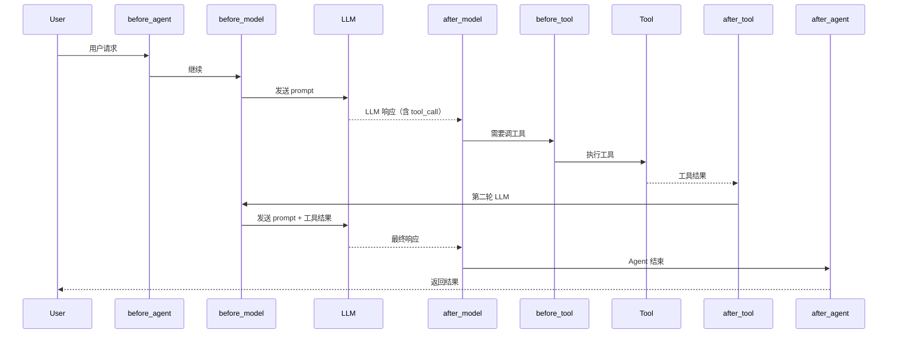
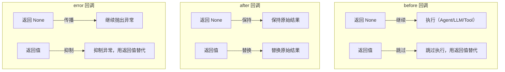
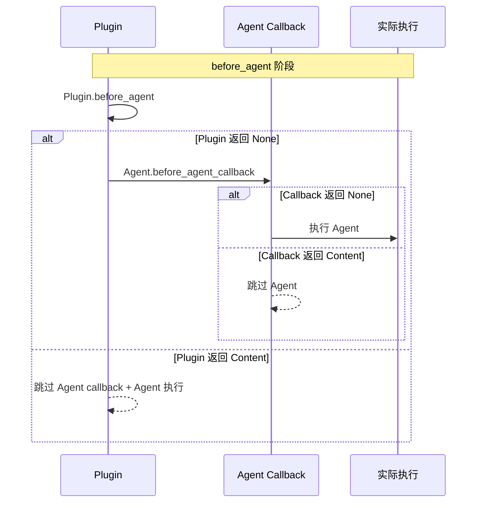
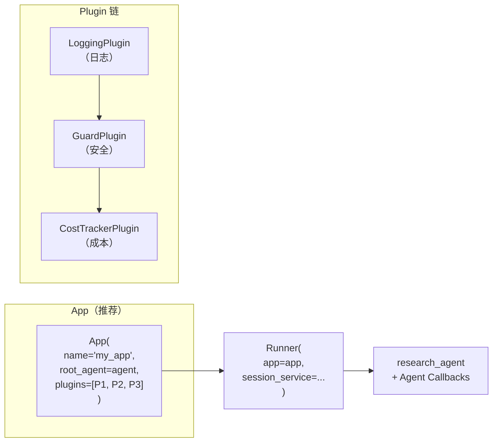
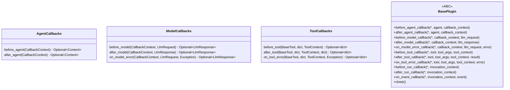
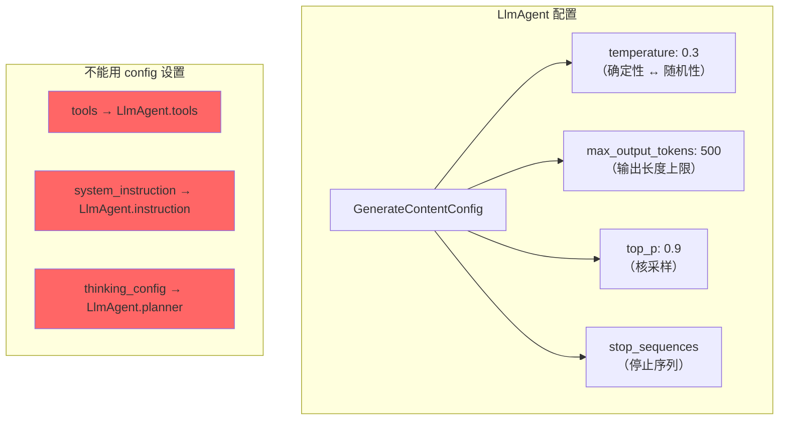
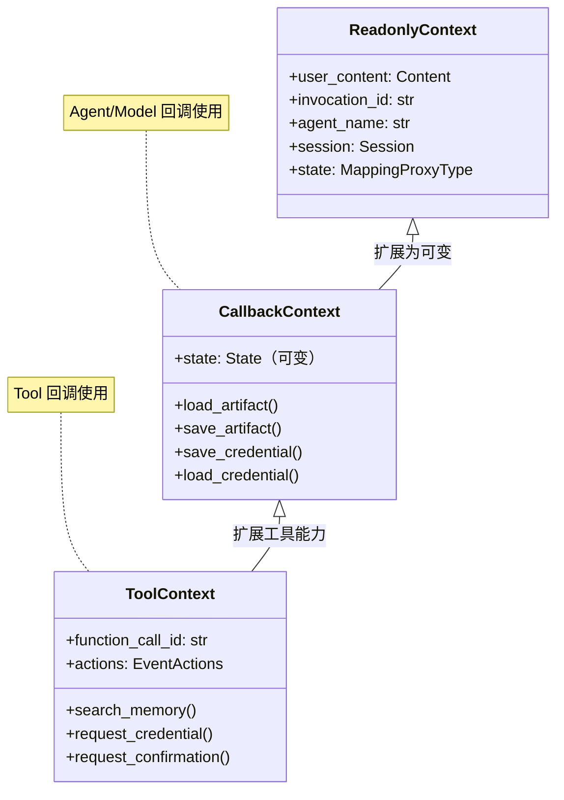
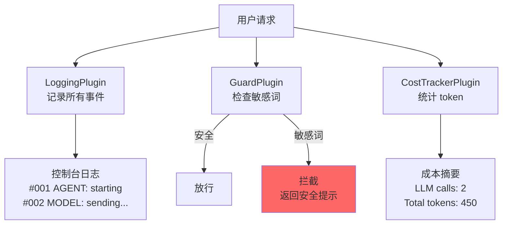
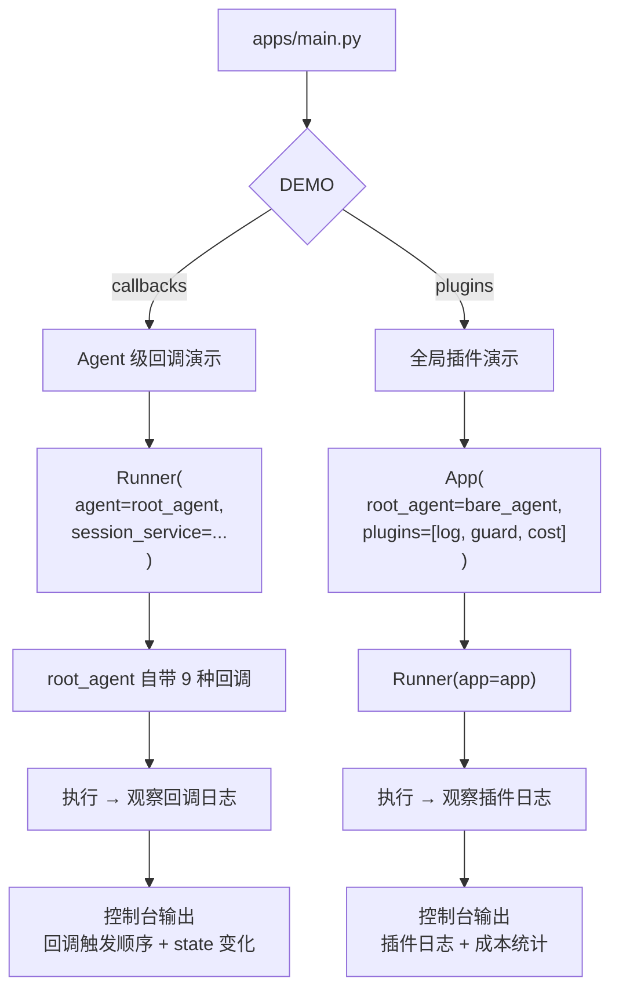

# 回调与插件：架构说明

## 核心理念

Agent 不应包含日志、安全、监控等横切逻辑——通过 Callback 和 Plugin 注入。

## 9 种回调的触发时序

## 回调返回值效果

## Plugin vs Callback 执行顺序

## Plugin 注册方式

## Callback 签名一览

## GenerateContentConfig 参数

## CallbackContext vs ToolContext

## 三个 Plugin 的职责

## 完整执行流程

